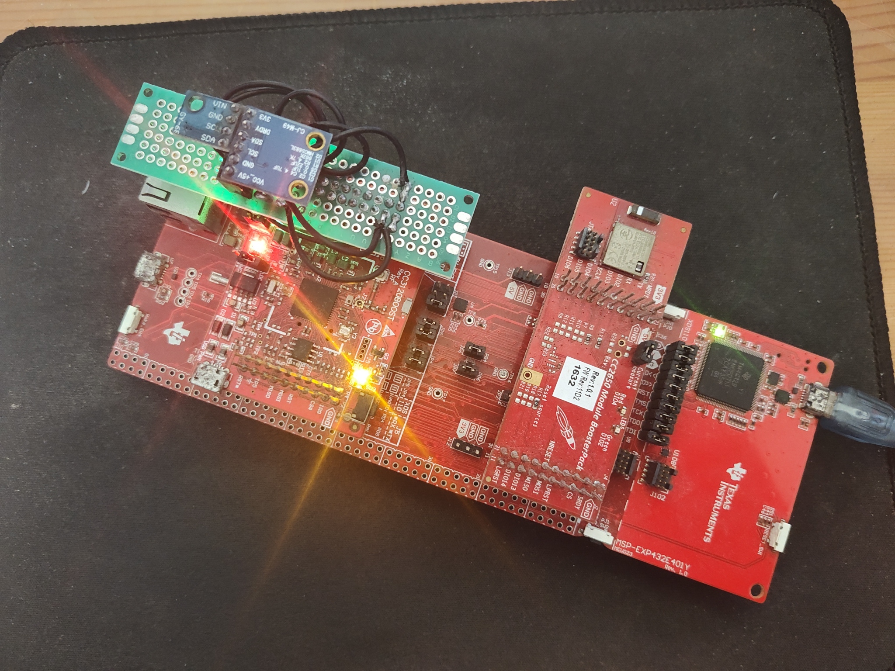
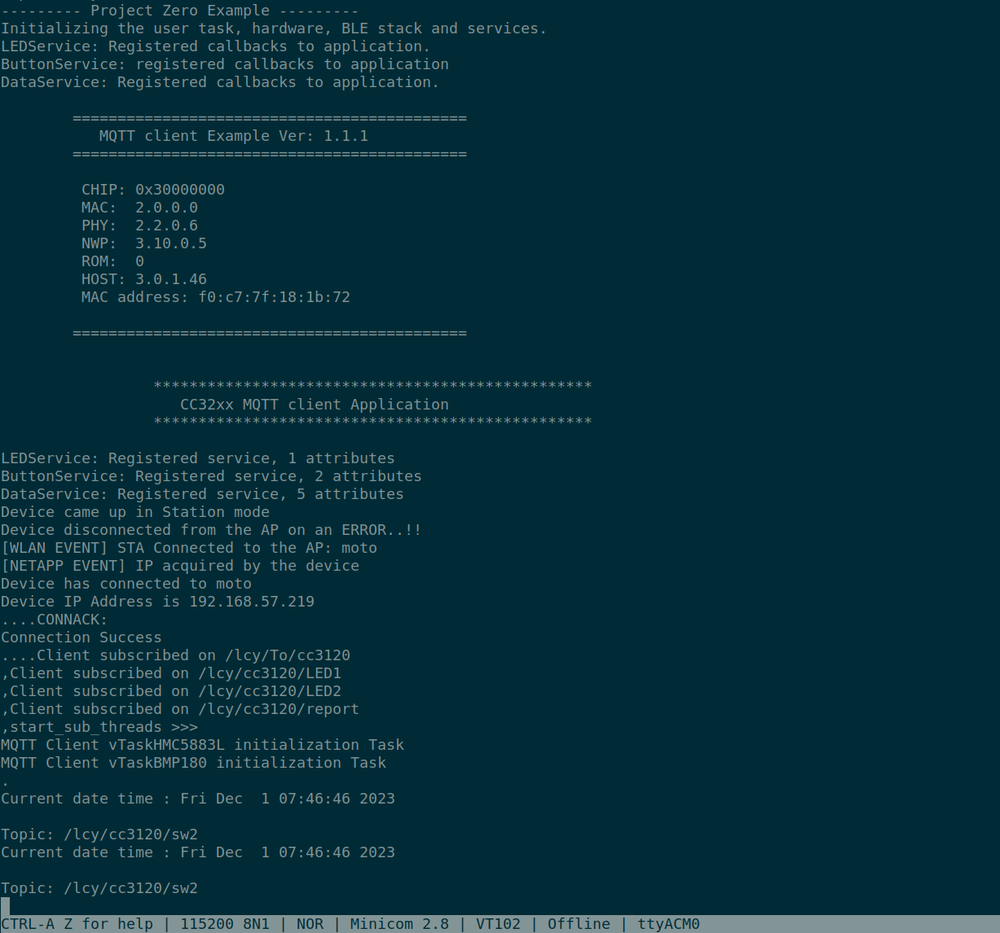

# Overview

* This application introduce the MQTT Client with WIFI and BLE usage by TI simplelink launchPad.

# Dependencies

* The application relies on many TI and  many third party software libraries. The following libraries need to be available:
  * [SIMPLELINK-MSP432-SDK](https://www.ti.com/tool/SIMPLELINK-MSP432-SDK)
  * [SIMPLELINK-SDK-BLUETOOTH-PLUGIN](https://www.ti.com/tool/SIMPLELINK-SDK-BLUETOOTH-PLUGIN)
  * [SIMPLELINK-SDK-WIFI-PLUGIN](https://www.ti.com/tool/SIMPLELINK-SDK-WIFI-PLUGIN)
  * [UniFlash](https://www.ti.com/tool/UNIFLASH)
  * [ARM-CGT](https://www.ti.com/tool/ARM-CGT)
  * [FreeRTOS](https://github.com/FreeRTOS/FreeRTOS-Kernel)

# Build

```sh
~$ ./build.sh

```
* Or like following the command but you should create intermediate files to store these variables before building.

```sh
mkdir build && cd build
cmake -DSIMPLELINK_MSP432E4_SDK_INSTALL_DIR=${SIMPLELINK_MSP432E4_SDK_INSTALL_DIR} \
      -DSIMPLELINK_MSP432_SDK_WIFI_PLUGIN_INSTALL_DIR=${SIMPLELINK_MSP432_SDK_WIFI_PLUGIN_INSTALL_DIR} \
      -DSIMPLELINK_SDK_BLE_PLUGIN_INSTALL_DIR=${SIMPLELINK_SDK_BLE_PLUGIN_INSTALL_DIR} \
      -DMSP432_TOOLCHAIN_PATH=${MSP432_TOOLCHAIN_PATH} \
      -DSYSCFG_TOOL_PATH=${SYSCFG_TOOL_PATH} \
      -DUSE_IPV6=OFF \
      -DSSID_NAME="${ssid_name}" \
      -DSSID_PWD="${ssid_pwd}" \
      -DMQTT_USER="${mqtt_user}" \
      -DMQTT_PWD="${mqtt_pwd}"  \
      -DMQTT_SRV_IP="${mqtt_srv_ip}" \
      -DCMAKE_VERBOSE_MAKEFILE:BOOL=ON ../

make
```


# UniFlash

* [UniFlash](https://www.ti.com/tool/UNIFLASH) is a software tool for programming on-chip flash on TI microcontrollers and wireless connectivity devices and on-board flash for TI processors. UniFlash provides both graphical and command-line interfaces.
* Supported devices: CC13xx, CC23xx, CC25xx, CC26xx, CC32xx, C2000™ microcontrollers, MSP430™ microcontrollers, MSP432™ microcontrollers, MSPM0, TM4C, Hercules™ microcontrollers, PGA9xx, UCD31xx, mmWave, AM3x, AM4x, AM5x, AM6x, K2G and J721E, J7AHP. For more details please refer to the release notes.


* Program the rom mode image file by UniFlash in command line.

```sh
~$ cd /opt/ti/uniflash_8.5.0
/opt/ti/uniflash_8.5.0 $./dslite.sh  --config=/fullpath/MSP432E401Y.ccxml -f -v /<fullpath rom mode file>/build/MSP432E401Y___freertos_ccs.out

or more details and examples, please refer to the UniFlash Quick Start guide.

CORTEX_M4_0: GEL Output:
Memory Map Initialization Complete
info: CORTEX_M4_0: Program verification successful for MSP432E401Y___freertos_ccs.out

```

# Test on board




# Error

* If you got error as follow, maybe should use `simplelink_msp432e4_sdk_4_10_00_13`.

```sh
No such resource: /ti/boards/MSP_EXP432E401Y_WITHOUT_USB.syscfg.json
Paths searched:
${SIMPLELINK_MSP432E4_SDK_INSTALL_DIR}/source/ti/boards/MSP_EXP432E401Y_WITHOUT_USB.syscfg.json
${SIMPLELINK_MSP432E4_SDK_INSTALL_DIR}/source/ti/boards/.meta/MSP_EXP432E401Y_WITHOUT_USB.syscfg.json
${SIMPLELINK_MSP432E4_SDK_INSTALL_DIR}/source/ti/.meta/boards/MSP_EXP432E401Y_WITHOUT_USB.syscfg.json
${SIMPLELINK_MSP432E4_SDK_INSTALL_DIR}/source/.meta/ti/boards/MSP_EXP432E401Y_WITHOUT_USB.syscfg.json

```
